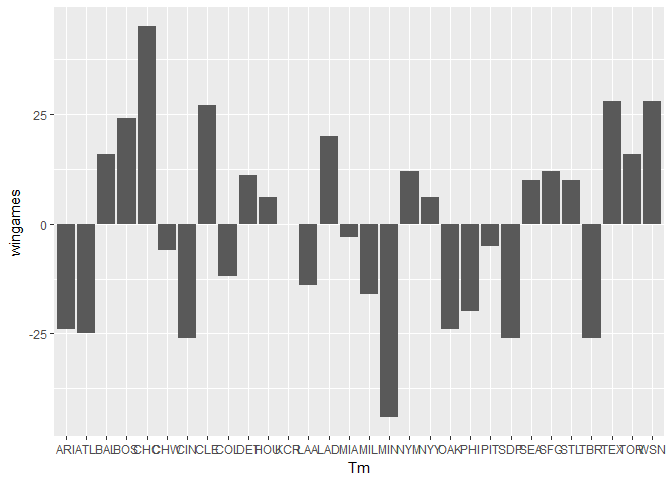

美國職棒大聯盟分析
================

組員姓名：B0444225黃筱茜、B0444220鍾家祺

分析議題背景
-------------

美國職棒大聯盟(MLB)是全世界最高的棒球殿堂，創立於1903年，在台灣成績較優秀的選手通常都會被MLB的球團賞識。MLB總共有30支隊伍，有29支來自美國各地，有1支來自加拿大，並且分為美聯以及國聯，隊伍名稱有奪冠最多次的紐約洋基、邁阿密馬林魚、波士頓紅襪、和2016年冠軍隊芝加哥小熊等等。目前旅美的台灣選手陳偉殷效力於邁阿密馬林魚隊擔任投手，並且是第4號先發，是我們台灣之光。

分析動機
--------

我們組員本身就對棒球有相當大的興趣，因此對於MLB也有一些了解，所以想要藉此機會來分析MLB各個隊伍的成績，也讓大家知道美國球類運動是多麼盛行。

使用資料
--------

1.2016年美國職棒聯盟每隊投手各項目平均成績 2.2016年美國職棒聯盟每隊的打擊手各項目平均成績 資料來源：BASEBALL REFERENCE的2016 MLB Team Statistics

載入使用資料們
--------------

``` r
library(readxl)
```

    ## Warning: package 'readxl' was built under R version 3.3.3

``` r
mlb_bat <- read_excel("C:/Users/Yuan/Downloads/mlb_bat.xlsx") #每隊的打擊手各項目平均成績
mlb_pitch <- read_excel("C:/Users/Yuan/Downloads/mlb_pitch.xlsx")  #每隊投手各項目平均成績
```

資料處理與清洗
--------------

``` r
mlb_pitch$W<-as.numeric(mlb_pitch$W) #轉為數字
mlb_pitch$L<-as.numeric(mlb_pitch$L) #轉為數字
mlb_pitch$wingames<-mlb_pitch$W-mlb_pitch$L #把兩個欄位相減得每隊勝負差之場數
a<-mlb_pitch[,c("Tm","wingames")] #只留下需要的欄位
knitr::kable(head(a[order(a$wingames,decreasing =T),],10)) #由大到小排序的前10筆資料
```

| Tm  |  wingames|
|:----|---------:|
| CHC |        45|
| TEX |        28|
| WSN |        28|
| CLE |        27|
| BOS |        24|
| LAD |        20|
| BAL |        16|
| TOR |        16|
| NYM |        12|
| SFG |        12|

探索式資料分析
--------------

``` r
library(dplyr)
```

    ## Warning: package 'dplyr' was built under R version 3.3.3

    ## 
    ## Attaching package: 'dplyr'

    ## The following objects are masked from 'package:stats':
    ## 
    ##     filter, lag

    ## The following objects are masked from 'package:base':
    ## 
    ##     intersect, setdiff, setequal, union

``` r
b<-summarise(mlb_bat,
          nTeam=n_distinct(Tm), #不重複的隊伍數
          meanR=mean(R_B),      #平均得分
          meanBB=mean(BB_B),    #平均保送
          meanSO=mean(SO_B),    #平均三振
          meanLOB=mean(LOB_B),  #平均殘壘
          meanHR=mean(HR_B),    #平均全壘打
          meanHBP=mean(HBP_B),  #平均觸身球
          meanRBI=mean(RBI_B),  #平均打點
          meanSF=mean(SF_B),    #平均高飛犧牲打
          meanSH=mean(SH_B))    #平均犧牲觸擊
knitr::kable(b)
```

|  nTeam|  meanR|    meanBB|  meanSO|   meanLOB|  meanHR|   meanHBP|  meanRBI|    meanSF|    meanSH|
|------:|------:|---------:|-------:|---------:|-------:|---------:|--------:|---------:|---------:|
|     30|  724.8|  502.9333|  1299.4|  1097.233|     187|  55.03333|    691.5|  40.46667|  34.16667|

``` r
library(ggplot2)
```

    ## Warning: package 'ggplot2' was built under R version 3.3.3

``` r
ggplot()+geom_bar(data = a,aes(Tm,wingames),stat="identity") #以勝負差畫長條圖
```



由這張長條圖得知2016的冠軍是芝加哥小熊(CHC)，而明尼蘇達雙城(MIN)為戰績最差的球隊

期末專題分析規劃
----------------

1.球隊在主、客場獲勝機率 2.選手國籍在全球的分布
